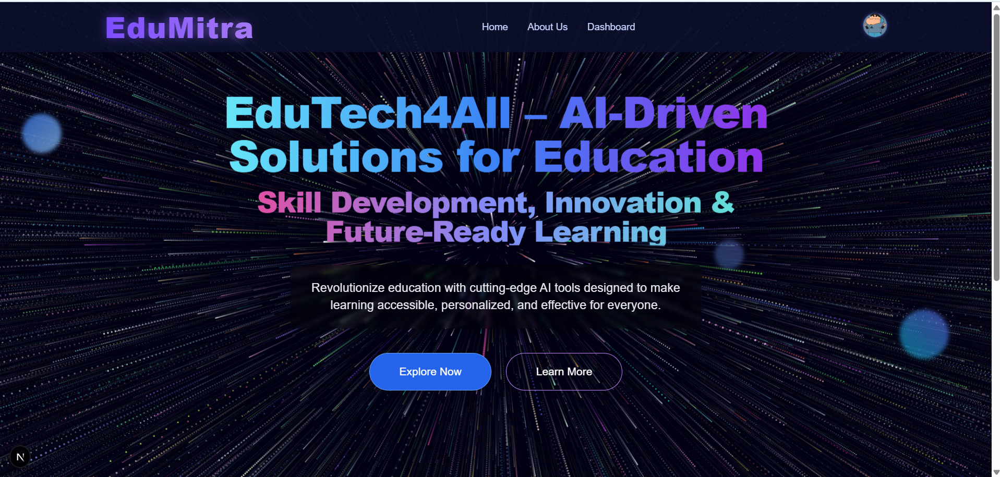
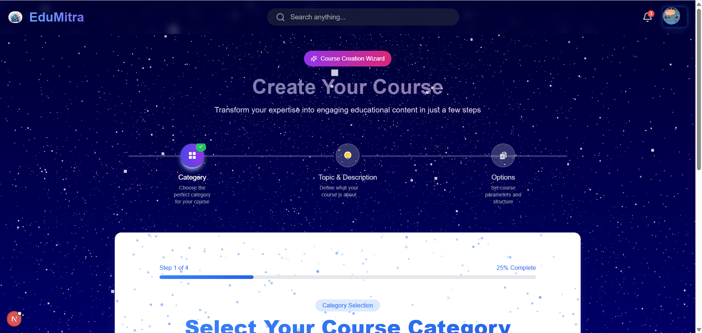
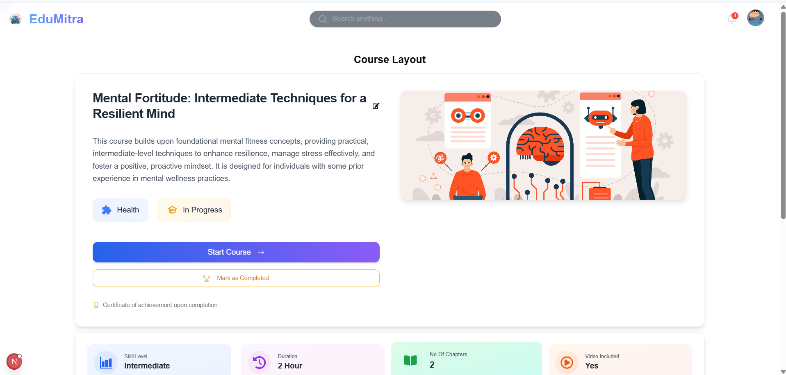

<<<<<<< HEAD
# 🚀 EduMitra: AI-Powered Personalized Learning Platform

🌟 EduMitra is a revolutionary web application that transforms the way people learn by leveraging cutting-edge AI technology to create personalized, distraction-free, and engaging learning experiences.

---

## 🎯 Problem Statement
Traditional learning platforms often:
- 🛑 Offer one-size-fits-all content  
- 📚 Lack personalization  
- 🔍 Require jumping between multiple resources  
- 🚫 Don't adapt to individual learning paces  

---

## ✨ Solution: EduMitra
EduMitra solves these challenges by:
- 🤖 AI-Powered Course Generation: Creates tailored courses using GEMINI AI  
- 📚 Custom Learning Paths: Generates structured courses based on user preferences  
- 🎥 Video Integration: Aggregates relevant YouTube videos alongside AI content  
- 🚀 Distraction-Free Environment: All-in-one platform to learn without distractions  

---

## 🖼️ Application Screenshots
<p align="center">
  
  
  
  
  
  
  
  
</p>

---

## 🛠️ Tech Stack

| Category             | Technologies                              |
|--------------------- |-------------------------------------------|
| 💻 Frontend         | Next.js 14, React, Tailwind CSS           |
| ⚙️ Backend          | Next.js App Router, Server-Side Rendering |
| 🔐 Authentication   | Clerk                                     |
| 🗄️ Database         | Neon, Drizzle ORM                         |
| 🤖 AI Integration   | Google GEMINI AI                          |
| 🚀 Deployment       | Vercel                                    |

---

## 🌈 Key Features

- 🤖 AI-Powered Course Generation: Instantly generates tailored courses using GEMINI AI.  
- 🎯 Personalized Learning Paths: Custom learning experiences suited to individual preferences.  
- 🎥 Intelligent Video Aggregation: Integrates relevant YouTube videos alongside AI content.  
- 🔒 Secure User Authentication: Seamless and secure login with Clerk.  
- 📊 Scalable Database Management: Efficient data handling with Neon + Drizzle ORM.  

---

## 🚀 Quick Start

### ✅ Prerequisites
Ensure you have the following installed:
- Node.js 18.x+  
- npm or yarn  
- Google Gemini API Key  
- Clerk Account  
- Neon Database  

### ⚙️ Installation Steps

1. Clone the repository
```bash
git clone https://github.com/ayushkumar1991/edumitra.git
cd edumitra
```

2. Install dependencies
```bash
npm install
```

3. Create `.env` file
```plaintext
# Database Connection
DATABASE_URL=your_neon_database_url

# Authentication
NEXT_PUBLIC_CLERK_PUBLISHABLE_KEY=your_clerk_key
CLERK_SECRET_KEY=your_clerk_secret_key

# AI Integration
GEMINI_API_KEY=your_gemini_api_key
```

4. Run the development server
```bash
npm run dev
```

---

## 📂 Project Structure

```
├── /components       # Reusable React components  
├── /app              # Next.js routing and pages  
├── /db               # Database schemas and models  
├── /hooks            # Custom React hooks  
├── /lib              # Utility functions  
├── /public           # Static assets  
├── /styles           # Global styles  
└── /README.md        # Documentation  
```

---

## 🔮 Future Roadmap

- 🌍 Multi-language Support: Expand to include courses in multiple languages.  
- 📊 Progress Tracking: Add interactive course progress monitoring.  
- 📝 Quizzes & Assessments: Integrate knowledge checks and quizzes.  
- 🌐 Offline Mode: Enable course access without an internet connection.  
- 🤖 Enhanced AI Recommendations: Smarter course suggestions based on preferences.  

---

## 🤝 Contributing

Contributions are welcome! 🎉  
To contribute:
1. Fork the repository  
2. Create your feature branch:  
```bash
git checkout -b feature/AmazingFeature
```
3. Commit your changes:  
```bash
git commit -m 'Add some AmazingFeature'
```
4. Push to the branch:  
```bash
git push origin feature/AmazingFeature
```
5. Open a Pull Request

---

## 📞 Contact & Support

👤 Ayush Kumar  
💼 [LinkedIn](https://www.linkedin.com/in/ayushkumar)  
🐱 [GitHub](https://github.com/ayushkumar1991)  

---

## 📄 License
Distributed under the MIT License. See `LICENSE` for more information.

---

🌟 Star this repository if you find it helpful! 🌟  
✅ Happy Learning with EduMitra! 🚀
=======
# Edu4All
>>>>>>> 59a303e38472abfa10cbf4021d3bbaa08bf73a94
